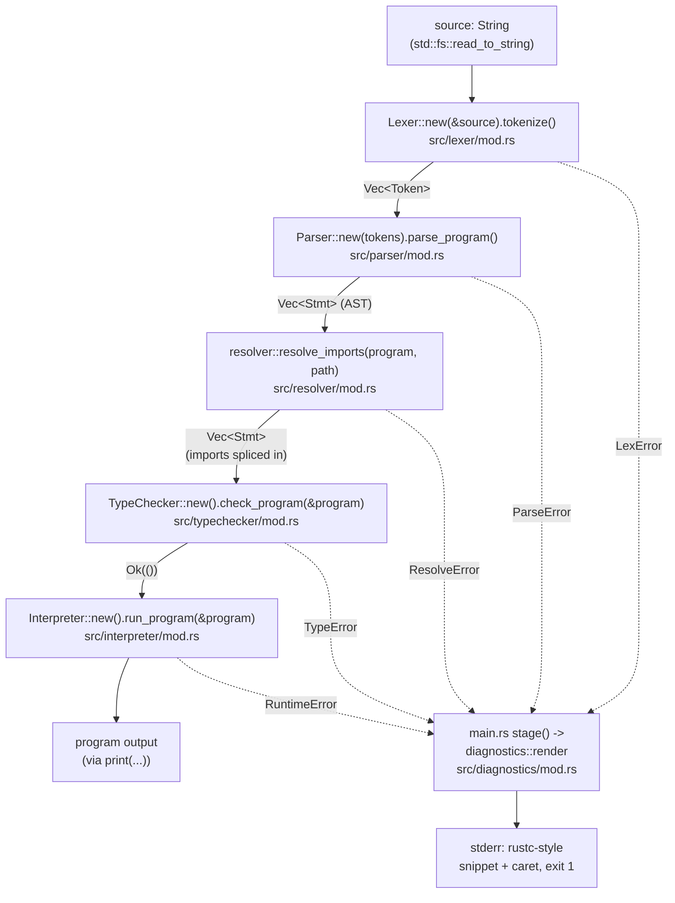
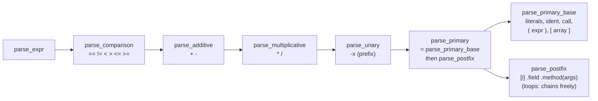
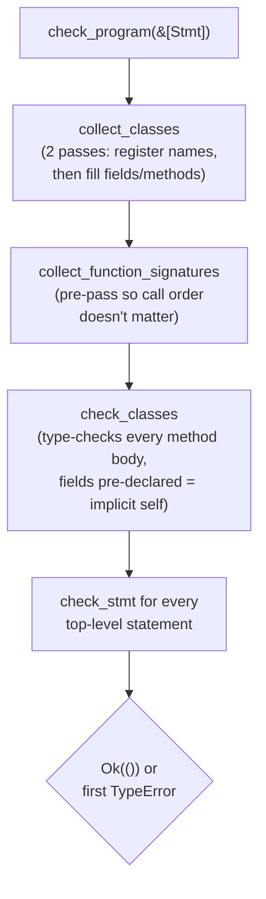
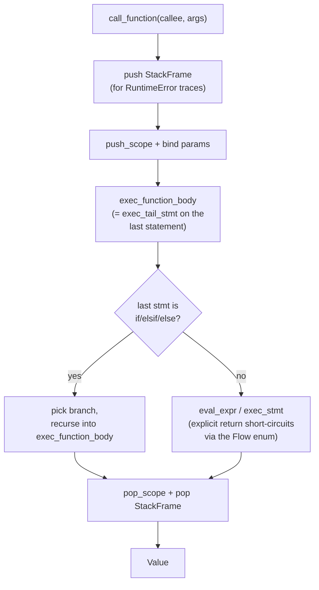

# Yara Architecture

How Yara actually turns a `.yara` file into running output, traced through the real functions in this repo. Written for anyone studying "how do you build a programming language" — every box below names a real type or function, not an idealized textbook stage.

## The pipeline

`main.rs::run_file` is the whole story in one function: read the file, then feed it through five stages in sequence, stopping at the first one that returns an error. (`main.rs` is a thin CLI binary over the `yara` **library crate** — `src/lib.rs` — where every stage actually lives; that split is what lets the pipeline be driven from the end-to-end `tests/`.)



Every stage's error type (`LexError`, `ParseError`, `ResolveError`, `TypeError`, `RuntimeError`) implements the `diagnostics::Diagnostic` trait (`kind`/`message`/`span`, plus `frames` for `RuntimeError`'s call stack) — which is what lets `diagnostics::render`, invoked by `main.rs`'s one-line `stage` helper, render all five with a single function instead of five bespoke printers. The stages keep their own distinct error types; only the rendering is shared.

Error positions in imported files are resolved via `diagnostics::SourceMap`: the resolver assigns each imported file a disjoint range of virtual line numbers, shifts the imported AST's positions into that range, and `render_with_map` uses the map to translate a diagnostic's virtual line back to (file, local line, snippet). This ensures errors from imported files render their correct source snippets, not the entry file's.

Beyond the five pipeline stages, a few small modules are shared across them, each a single source of truth for one concern: `diagnostics` (error rendering, above), `env` (the `Environment<T>` scope stack the typechecker and interpreter both use — over `Type` and `Value` respectively), `types` (type-name alias normalization, `Int`→`Integer`), and `builtins` (the array-builtin name+arity registry both stages consult). See `src/CLAUDE.md`.

## Lexer: character to token

`Lexer::tokenize` is a loop: skip whitespace/comments, look at the next character, and dispatch purely on what *kind* of character it is.

```mermaid
flowchart TD
    Start(["next char?"]) -->|digit| Num["read_number\n(int or float)"]
    Start -->|'\"'| Str["read_string\n(escapes: \\n \\t \\\" \\\\)"]
    Start -->|letter or '_'| Ident["read_ident_or_keyword\n(keyword table or Ident)"]
    Start -->|anything else| Op["read_operator\n(1 or 2 char, maximal munch)"]
    Start -->|none left| Eof["emit TokenKind::Eof"]
    Num --> Tok["push Token{kind, line, column}"]
    Str --> Tok
    Ident --> Tok
    Op --> Tok
    Tok --> Start
```

`peek`/`peek_next`/`advance` are the only primitives that touch the underlying `Vec<char>` and position counters — every sub-lexer (`read_number`, `read_string`, ...) is built purely on top of those three, which is why line/column tracking only has to be correct in one place (`advance`).

## Parser: precedence climbing + recursive descent

Statements dispatch on the leading token (`parse_stmt`), same as the lexer dispatches on the leading character. Expressions use **precedence climbing**: each precedence level is a function that first asks the next-tighter level to parse an operand, then loops consuming operators *at its own level*, building a left-associative tree.



Loosest-binding (comparison) is outermost, tightest-binding (postfix indexing/field-access/calls) is innermost — so `1 + 2 * 3` parses as `1 + (2 * 3)` for free, without a precedence table, purely from the call order.

`parse_ident_stmt` disambiguates four statement shapes that all start with a bare identifier — `x = expr`, `x: Type = expr`, `obj.field = value`, and a bare expression statement like `foo()` — by parsing a full expression first and then pattern-matching on what shape it turned out to be (`Expr::Ident` -> `Stmt::VarDecl`, `Expr::FieldAccess` -> `Stmt::FieldAssign`, anything else -> `Stmt::ExprStmt`).

Type annotations in declarations are parsed by `parse_type_annotation`, which is **recursive**: it recognizes the `Ptr<T>` prefix and recursively parses the inner type, building a tree for complex types like `Ptr<Ptr<Integer>>`. This is the only place in the grammar that accepts generic-like syntax.

## Typechecker: two collection passes, then check



The two-pass class collection matters for a subtle reason: a class's field/param/return annotations might name *another* class (or itself), so every class name has to exist in `self.classes` before any class's fields are actually type-resolved — otherwise declaration order would matter, which would be surprising.

`check_body_return_type`/`check_tail_stmt` implement Ruby-style implicit last-expression return, including the trickiest part: a trailing `if`/`elsif`/`else` is itself a tail expression, so `factorial`'s whole body (an `if`/`else` with no statement after it) can be its return value — each branch's own tail type is computed recursively and all branches present must agree.

Pointer types (`Type::Pointer`) are built by recursively resolving the inner type from the `Ptr<T>` annotation syntax. The typechecker verifies that `alloc`, `deref`, `set_deref`, and `free` receive the correct argument types and return types — e.g., `deref(p: Ptr<T>)` type-checks only if `p` is indeed a pointer, and returns type `T`.

## Interpreter: tree-walking, no bytecode

There's no compilation to bytecode or machine code — `Interpreter::eval_expr`/`exec_stmt` walk the same `Stmt`/`Expr` tree the parser built, directly executing it.



Arrays (`Value::Array`) and class instances (`Value::Instance`) both use `Rc<RefCell<..>>` for reference semantics — cloning the `Value` (e.g. passing it as a function argument) shares the same backing storage, so a called function's `push`/`set`/field-assignment is visible to the caller. This is what makes the arena-style data structures in `examples/data_structures/` work without a real pointer type, and what makes `h.count = 10` after `Hello.new(...)` actually mutate the instance.

Class method calls (`run_method`) use a copy-in/copy-out trick for implicit `self`: the instance's current field values are copied into the method's own scope before the body runs (so a bare `count` reads/writes like any local variable), then the same keys are copied back into the instance's shared field map afterward.

**Heap and pointer semantics:** The interpreter maintains a heap (`Vec<Option<Value>>`) where each index is a potential storage slot. `alloc(v)` finds an unused slot, writes `Some(v)` into it, and returns `Value::Pointer(index)` — a handle to that slot. `deref(p)` reads the slot; if it contains `None` (previously freed), a `RuntimeError("use after free")` is raised. `set_deref(p, v)` writes to the slot, with the same freed-slot check. `free(p)` writes `None` to the slot; calling `free` twice on the same pointer raises `RuntimeError("double free")`. Slots are never reused after being freed — each allocation claims an ever-increasing index — making use-after-free and double-free mistakes visible and diagnosable, the pedagogical point for teaching manual memory management.

## Where to read next

Each stage's own `CLAUDE.md` (`src/lexer/CLAUDE.md`, `src/ast/CLAUDE.md`, `src/parser/CLAUDE.md`, `src/typechecker/CLAUDE.md`, `src/interpreter/CLAUDE.md`, `src/resolver/CLAUDE.md`, `src/diagnostics/CLAUDE.md`) has more implementation-level detail, gotchas, and known gaps than fits here; `src/CLAUDE.md` covers the flat support files (`lib.rs`, `main.rs`, `env.rs`, `types.rs`, `builtins.rs`). `docs/syntax.md` documents the language grammar itself, not the implementation.
