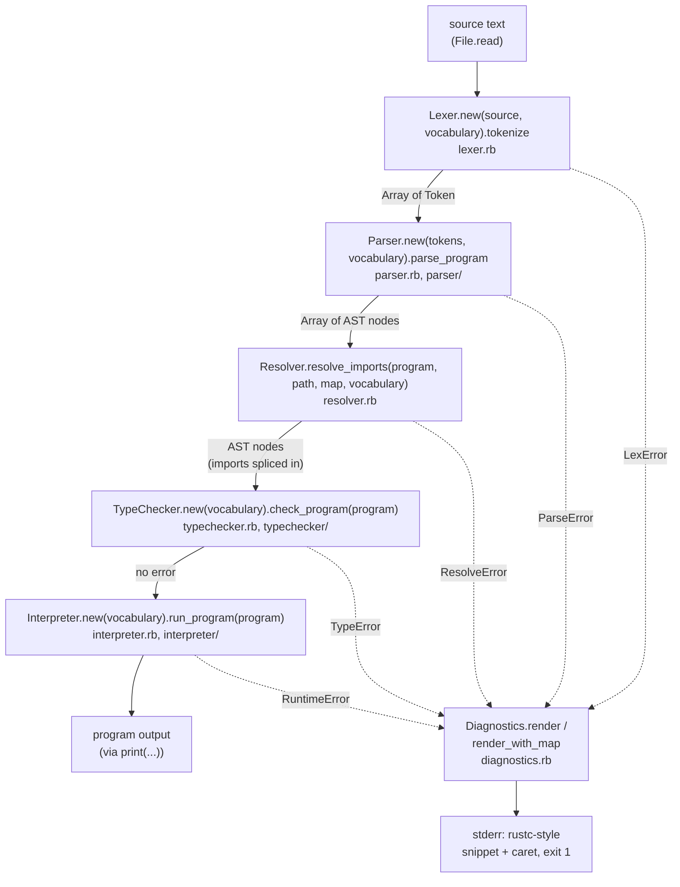
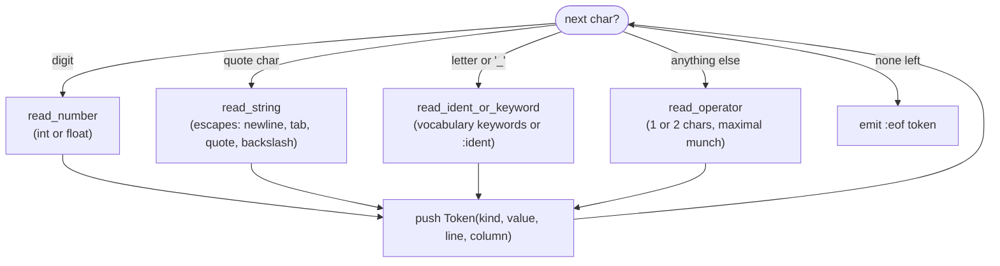
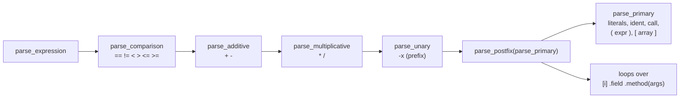
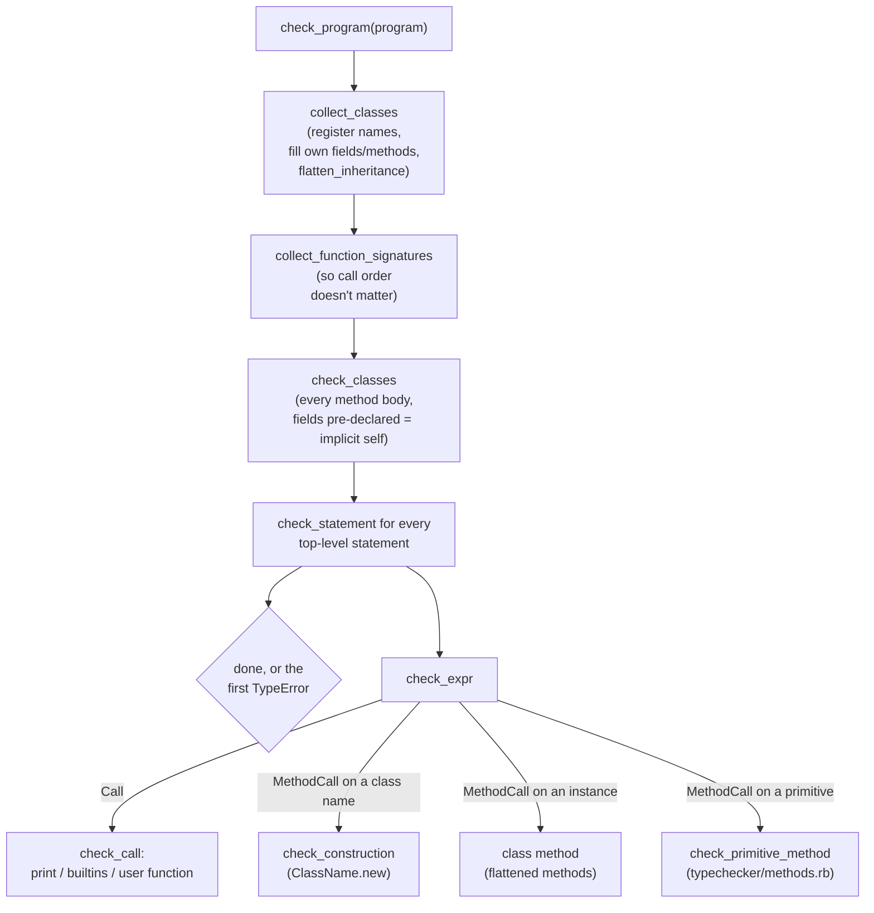
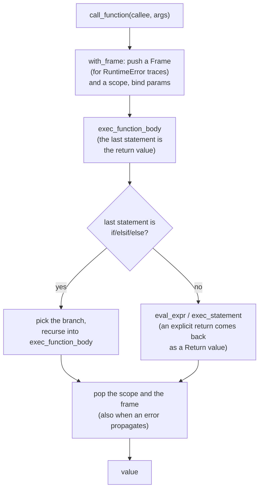

# Yara Architecture

How Yara turns a `.yara` file into running output, traced through the real code in `ruby/lib/yara/`. Written for anyone studying how a programming language is built: every box below names a real class or method, not an idealized textbook stage.

## The pipeline

`CLI.run_file` (`cli.rb`) is the whole story in one method: read the file, load the vocabulary (English unless `--vocabulary` names a file), then feed the source through five stages in order, stopping at the first error. Every stage receives the same `Vocabulary`, so keyword, type, builtin and method spellings and error prose all come from one place.

Every stage's error class (`LexError`, `ParseError`, `ResolveError`, `TypeError`, `RuntimeError`) inherits from `Diagnostics::Error`, which carries the message and position; each subclass names its `kind` (`"type error"`), and `RuntimeError` also returns its call-stack `frames`. That shared shape is what lets one renderer print all five. The stages keep their own error classes; only the rendering is shared.

Errors in imported files resolve through `Diagnostics::SourceMap`: the resolver gives each imported file a disjoint range of virtual line numbers, shifts the imported AST into that range, and `render_with_map` maps a diagnostic's virtual line back to the file, its local line and its snippet.

Beyond the stages, a few files are shared, each the single source of truth for one concern: `diagnostics.rb` (rendering), `environment.rb` (the scope stack the typechecker fills with types and the interpreter with values), `types.rb` (alias normalization, `Int` to `Integer`), `builtins.rb` and `methods.rb` (the builtin and primitive-method registries), `messages.rb` (the English message catalog) and `rust_format.rb` (number formatting). `ruby/lib/yara/CLAUDE.md` describes each.

The same Ruby files run two ways: under CRuby through `ruby/bin/yara`, and compiled to mruby bytecode inside the standalone `ruby/build/yara` executable (see `ruby/README.md`).

## Lexer: character to token

`Lexer#tokenize` is a loop: skip whitespace and comments, look at the next character, and dispatch purely on what kind of character it is.

`peek` and `advance` are the only methods that move through the characters, and every reader is built on them, which is why line and column tracking only has to be right in one place (`advance`). There is no `Regexp`: the lexer walks characters by hand, which also keeps it within what mruby supports.

## Parser: precedence climbing and recursive descent

Statements dispatch on the leading token (`parse_statement`), the way the lexer dispatches on the leading character. Expressions use precedence climbing: each level asks the next tighter level for an operand, then loops consuming operators at its own level, building a left-associative tree.

The loosest binding (comparison) is outermost and the tightest (postfix indexing, field access, method calls) innermost, so `1 + 2 * 3` parses as `1 + (2 * 3)` from the call order alone, with no precedence table. The three binary levels share `parse_left_associative`.

`parse_ident_statement` tells apart the statements that start with a bare identifier: `x: Type = expr` by its colon, and otherwise by parsing a full expression first and then looking at what it turned out to be (`Ident` before `=` is a `VarDecl`, `FieldAccess` a `FieldAssign`, anything else without `=` an expression statement).

`parse_type_annotation` is recursive: it recognizes `Ptr` and parses the inner type between `<` and `>`, so `Ptr<Ptr<Integer>>` works. It is the only place in the grammar with generic-looking syntax.

## Typechecker: collect first, then check

Class collection comes first for a reason: a class's field, parameter and return annotations can name another class, or itself, so every class name must be registered before any annotation is resolved. Otherwise declaration order would matter.

**Inheritance** (`class Child < Parent`) adds `flatten_inheritance` after each class's own members are collected: it rejects unknown parents and cycles, then walks classes parents first, merging each parent's already flattened fields and methods into the child, with the child's own members winning. Everything after it sees complete classes and needs no inheritance logic, except `check_fields_assigned`, which walks the parent chain so a child's `initializer` must assign inherited fields too (there is no `super`). The interpreter flattens its own class table the same way.

**Primitive methods** (`xs.size()`, `2.to_s()`): `check_method_call` checks the receiver first. An instance goes to its class's methods. Any other type with a receiver kind (`Type#receiver_kind`) goes to `check_primitive_method`, which looks the method up in `methods.rb`, checks arity and returns the result type. `nil.foo()` has no receiver kind and is an error.

`check_body_return_type` and `check_tail` implement Ruby-style implicit return, including the tricky part: a trailing `if`/`elsif`/`else` is itself a tail expression, so a whole `factorial` body that is one `if`/`else` can be its return value. Each branch's tail type is computed recursively and all branches must agree.

Pointer types come from resolving `Ptr<T>` annotations recursively. `alloc`, `deref`, `set_deref` and `free` are checked like any builtin: `deref(p)` type-checks only if `p` is a pointer, and has the pointee's type.

## Interpreter: tree walking, no bytecode

There is no compilation step: `eval_expr` and `exec_statement` walk the same AST the parser built. Method calls mirror the typechecker: `call_method` evaluates the receiver; an `Instance` uses its class's methods, and any other value with a receiver kind goes to `eval_primitive_method`.

Arrays and instances are Ruby objects shared by reference, so passing one to a function shares it: a called function's `push`, `set` or field assignment is visible to the caller. That is what makes the arena-style data structures in `examples/data_structures/` work, and what makes `h.count = 10` after `Hello.new(...)` change the instance.

Method calls (`run_method`) implement implicit `self` by copying: the instance's fields are copied into the method's scope before the body runs, so a bare `count` reads and writes like a local, and the same names are copied back into the instance afterwards.

**Heap and pointers:** the interpreter keeps a heap, an array of slots. `alloc(v)` appends a slot holding `v` and returns a `Pointer` to its index. `deref(p)` reads the slot and `set_deref(p, v)` writes it; either raises "use after free" if the slot was freed. `free(p)` empties the slot, and freeing it again raises "double free". Slots are never reused, so these mistakes are always visible and diagnosable, which is the point of teaching manual memory management this way.

**Mark and sweep:** `collect()` runs a garbage collector over the same heap. Mark: every value bound in every live scope is a root, and marking follows pointers through array elements, instance fields and pointee slots, with an identity set so cycles end. Sweep: every allocated slot left unmarked is emptied, exactly as `free` would, and the count is returned. `examples/pointers/gc.yara` shows both memory models side by side.

**Numbers:** integers stay within 64 bits (overflow is a runtime error) and `/` truncates toward zero. Floats print through `RustFormat`, which also parses float literals; both directions use exact integer arithmetic, so the output is the same under CRuby and mruby.

## Where to read next

`ruby/lib/yara/CLAUDE.md` covers the lexer, resolver, vocabularies and shared files; `ruby/lib/yara/parser/CLAUDE.md`, `ruby/lib/yara/typechecker/CLAUDE.md` and `ruby/lib/yara/interpreter/CLAUDE.md` cover the rest, with more implementation detail, gotchas and known gaps than fits here. `docs/syntax.md` documents the language itself, not the implementation.
